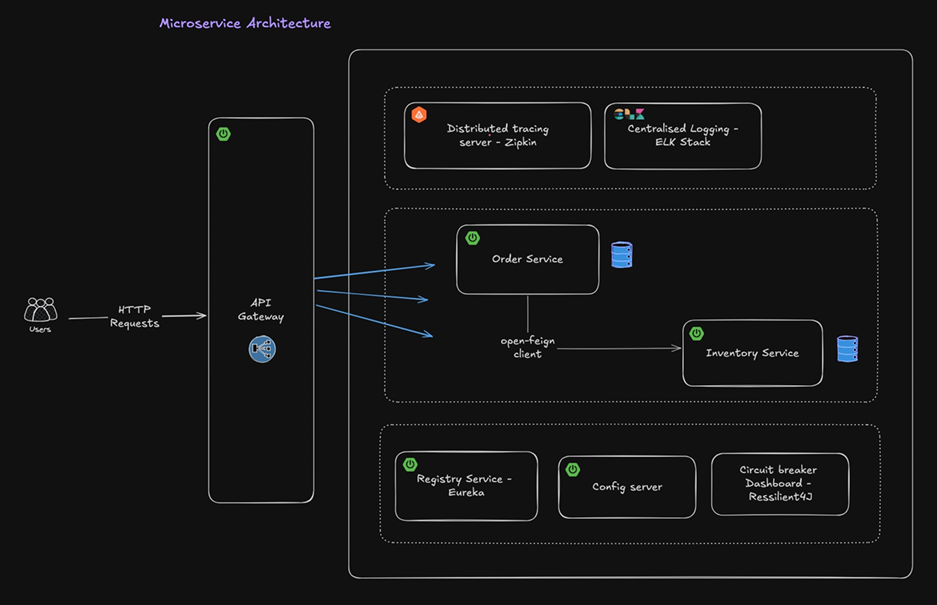

# eCommerce Microservice Project

This is a basic eCommerce microservice project that includes two main services: **Orders** and **Product Inventory**. 

## Project Overview

This project is designed to demonstrate various concepts of **microservice architecture**, including service registration, communication, resilience, and monitoring. It features multiple tools and technologies to build a robust and scalable microservice ecosystem.

### Services

1. **Orders Service**: Manages customer orders and related functionalities.
2. **Product Inventory Service**: Handles product inventory, availability, and stock management.

## Key Learnings

Through this project, I have learned the following concepts:

### 1. Introduction to Microservice Architecture
- The project introduces the fundamentals of microservice architecture, where different functionalities are split into independent services that can be developed, deployed, and scaled separately.

### 2. Setting up Microservices
- Implementing microservices with Spring Boot, Spring Cloud, and other related technologies.

### 3. Service Registration and Service Registry with Eureka
- **Eureka Server**: Service discovery and registration for microservices.

### 4. Spring Cloud API Gateway
- API Gateway for routing requests to respective microservices using **Spring Cloud Gateway**.

### 5. OpenFeign Microservice Communication
- **OpenFeign** is used to enable HTTP-based communication between microservices.

### 6. Circuit Breaker, Rate Limiter, and Retry with Resilience4j
- Implementing **Resilience4j** for fault tolerance in communication between services, including **Circuit Breaker**, **Rate Limiter**, and **Retry** mechanisms.

### 7. API Gateway Filters
- Custom **filters** to handle specific tasks like logging, request validation, etc., at the API Gateway level.

### 8. Authentication in Gateway Filters
- Authentication and Authorization are handled via **Gateway Filters** before forwarding requests to the respective services.

### 9. Centralized Configuration Server with GitHub
- **Spring Cloud Config Server** is used for centralized configuration management, storing configuration files in a **GitHub repository**.

### 10. Refresh Configuration Without Restart using `@RefreshScope`
- Configuration can be refreshed dynamically without restarting the microservices using `@RefreshScope`.

### 11. Distributed Tracing using Zipkin and Micrometer
- Implementing **distributed tracing** with **Zipkin** and **Micrometer** to monitor and trace requests across different services.

### 12. Centralized Logging with ELK Stack
- Logs from all microservices are aggregated and analyzed in a centralized manner using the **ELK Stack (Elasticsearch, Logstash, and Kibana)**.

## Technologies Used

- **Spring Boot**: Framework for building microservices
- **Spring Cloud**: For handling distributed systems concerns
- **Eureka**: Service registry
- **Spring Cloud Gateway**: API Gateway for routing and filtering
- **Resilience4j**: Fault tolerance and resilience mechanisms
- **OpenFeign**: Simplified communication between microservices
- **GitHub**: For storing configuration files
- **Zipkin & Micrometer**: Distributed tracing
- **ELK Stack**: Centralized logging

## Running the Project

1. **Set up Eureka Server** for service discovery.
2. **Start the Product Inventory Service** and **Orders Service**.
3. **Run the API Gateway** to route requests to the services.
4. Make sure that **Spring Cloud Config Server** is running to fetch configuration from GitHub.

## API Documentation

For detailed API documentation, visit [Postman Documentation](https://documenter.getpostman.com/view/30415721/2sAYBPnF6q).
